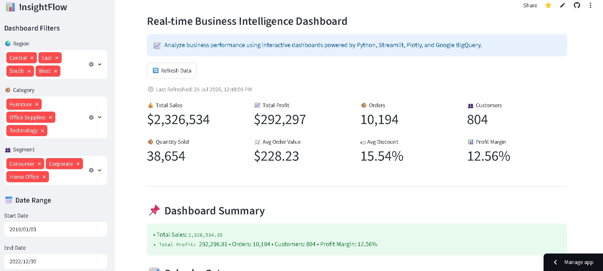
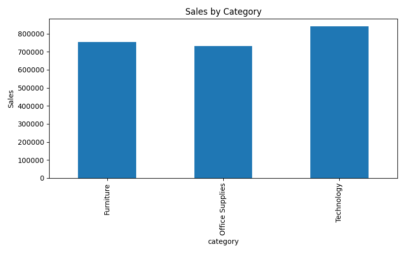
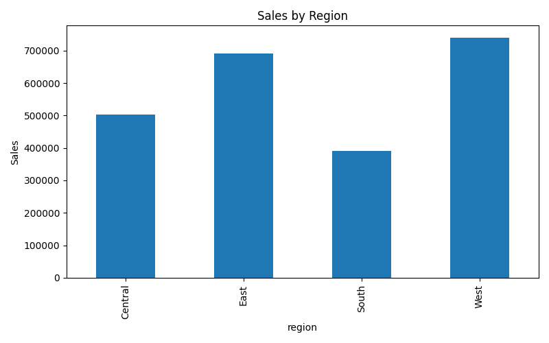
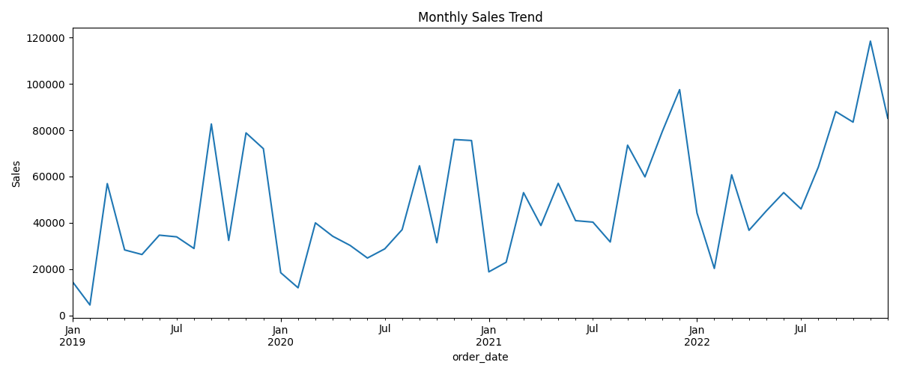
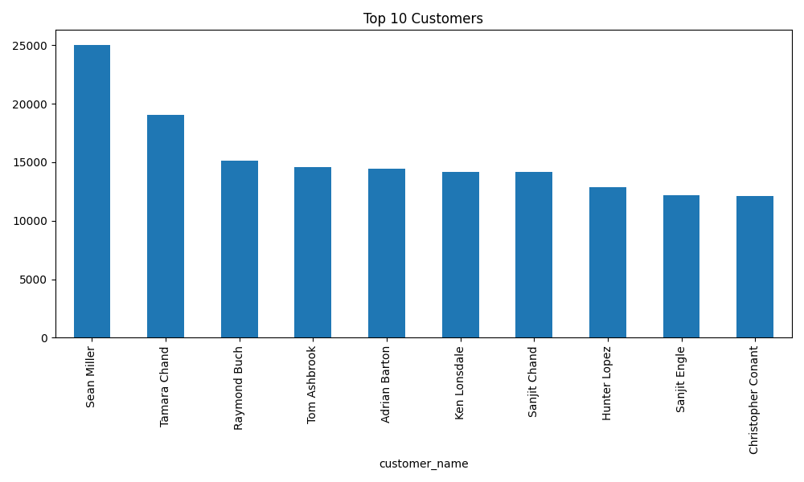

# 📊 InsightFlow Cloud Business Intelligence Platform


A cloud-powered **Business Intelligence Dashboard** built using **Python, Google BigQuery, SQL, Streamlit, Pandas, and Plotly**. The application provides real-time business insights through interactive dashboards, KPI monitoring, filtering, and advanced analytics.

---

# 🌐 Live Demo

### 🚀 Streamlit Application

**https://insightflow-cloud-business-intelligence-platform-dvnzkctr99lnk.streamlit.app/**

---

# 📖 Project Overview

InsightFlow is an end-to-end Cloud Business Intelligence Platform that enables users to analyze sales, profit, customers, products, and regional performance using interactive dashboards backed by Google BigQuery.

The project demonstrates a complete cloud analytics workflow from data storage and querying to visualization and deployment.

---

# ✨ Features

- 📊 Interactive KPI Dashboard
- ☁️ Google BigQuery Integration
- 🔍 Dynamic Dashboard Filters
- 💰 Sales Analysis
- 📈 Profit Analysis
- 🌍 Regional Analysis
- 👥 Customer Segmentation
- 📦 Product Performance
- 📅 Monthly Sales Trends
- 📊 Correlation Heatmap
- 📥 Export Filtered Data as CSV
- 🔄 Real-Time Data Refresh

---

# 🛠 Tech Stack

| Category | Technology |
|----------|------------|
| Programming | Python |
| Cloud Database | Google BigQuery |
| Dashboard | Streamlit |
| Visualization | Plotly |
| Data Analysis | Pandas |
| Query Language | SQL |
| Version Control | Git & GitHub |

---

# 🏗 Architecture

```
CSV Dataset
      │
      ▼
Google BigQuery
      │
SQL Queries
      │
      ▼
Python (Pandas)
      │
      ▼
Streamlit Dashboard
      │
      ▼
Interactive Business Insights
```

---

# 📊 Dashboard Screenshots

## 🏠 Dashboard Home



---

## 📊 Sales by Category



---

## 🌍 Sales by Region



---

## 📈 Monthly Sales Trend



---

## 👥 Top Customers



---


# 📈 Key Performance Indicators

- Total Sales
- Total Profit
- Orders
- Customers
- Quantity Sold
- Average Order Value
- Average Discount
- Profit Margin

---

# 💡 Business Insights

The dashboard helps users:

- Monitor business performance
- Compare regional sales
- Identify profitable categories
- Discover top customers
- Track monthly trends
- Analyze discounts and profitability
- Make data-driven decisions

---

# 📂 Project Structure

```
InsightFlow-Cloud-Business-Intelligence-Platform
│
├── data/
├── images/
│   ├── dashboard_home.png
│   ├── dashboard_filters.png
│   ├── kpi_cards.png
│   ├── sales_by_category.png
│   ├── sales_by_region.png
│   ├── monthly_sales.png
│   ├── top_customers.png
│   └── correlation_heatmap.png
│
├── scripts/
├── sql/
├── app.py
├── bigquery_connection.py
├── requirements.txt
├── README.md
├── LICENSE
└── .gitignore
```

---

# 🚀 Installation

## Clone Repository

```bash
git clone https://github.com/YukthaK215/InsightFlow-Cloud-Business-Intelligence-Platform.git
```

## Install Dependencies

```bash
pip install -r requirements.txt
```

## Run Streamlit

```bash
streamlit run app.py
```

---

# 🔮 Future Enhancements

- Machine Learning Sales Forecasting
- Customer Segmentation using AI
- Automated Report Generation
- Real-Time Streaming Analytics
- Advanced Business KPIs
- Forecast Dashboard

---

# 👩‍💻 Author

**Yuktha K**

GitHub:
https://github.com/YukthaK215

---

# ⭐ Support

If you found this project useful, consider giving it a ⭐ on GitHub.

---

## 📄 License

This project is licensed under the **MIT License**.
